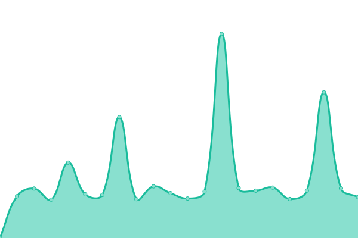

# [📈 Live Status](https://upptime.99g.free.hr): <!--live status--> **🟩 All systems operational**

This repository contains the open-source uptime monitor and status page for [ShaunHigh](https://upptime.99g.free.hr), powered by [Upptime](https://github.com/upptime/upptime).

With [Upptime](https://upptime.js.org), you can get your own unlimited and free uptime monitor and status page, powered entirely by a GitHub repository. We use [Issues](https://github.com/ShaunHigh/upptime/issues) as incident reports, [Actions](https://github.com/ShaunHigh/upptime/actions) as uptime monitors, and [Pages](https://upptime.99g.free.hr) for the status page.

<!--start: status pages-->
<!-- This summary is generated by Upptime (https://github.com/upptime/upptime) -->
<!-- Do not edit this manually, your changes will be overwritten -->
<!-- prettier-ignore -->
| URL | Status | History | Response Time | Uptime |
| --- | ------ | ------- | ------------- | ------ |
|  [replit-uptime](https://f7771d81-a8ff-4d67-aba6-1684fe874517-00-6kck8g67jov0.teams.replit.dev) | 🟩 Up | [replit-uptime.yml](https://github.com/ShaunHigh/upptime/commits/HEAD/history/replit-uptime.yml) | 

 323ms
     
 | 

<a href="https://99g.free.hr/history/replit-uptime">100.00%</a>
    

|  [glitch-alist](https://grizzly-shell-beast.glitch.me) | 🟩 Up | [glitch-alist.yml](https://github.com/ShaunHigh/upptime/commits/HEAD/history/glitch-alist.yml) | 

 270ms
     
 | 

<a href="https://99g.free.hr/history/glitch-alist">100.00%</a>
    

|  [replit-alist](https://881e9465-b649-4a95-b380-5234293d5a21-00-16qfodawdcz3f.teams.replit.dev) | 🟩 Up | [replit-alist.yml](https://github.com/ShaunHigh/upptime/commits/HEAD/history/replit-alist.yml) | 

 269ms
     
 | 

<a href="https://99g.free.hr/history/replit-alist">100.00%</a>
    

|  [uptime-render](https://bot-pt3a.onrender.com) | 🟩 Up | [uptime-render.yml](https://github.com/ShaunHigh/upptime/commits/HEAD/history/uptime-render.yml) | 

 531ms
     
 | 

<a href="https://99g.free.hr/history/uptime-render">100.00%</a>
    

<!--end: status pages-->

[**Visit our status website →**](https://upptime.99g.free.hr)

## 📄 License

- Powered by: [Upptime](https://github.com/upptime/upptime)
- Code: [MIT](./LICENSE) © [ShaunHigh](https://upptime.99g.free.hr)
- Data in the `./history` directory: [Open Database License](https://opendatacommons.org/licenses/odbl/1-0/)
